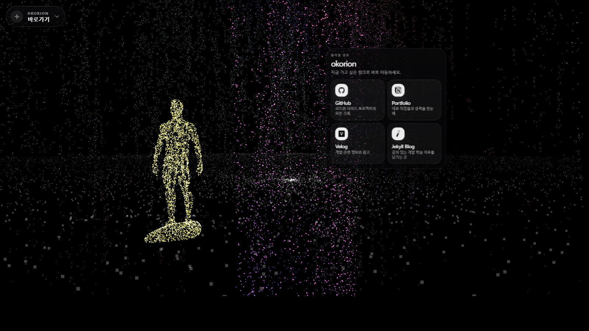
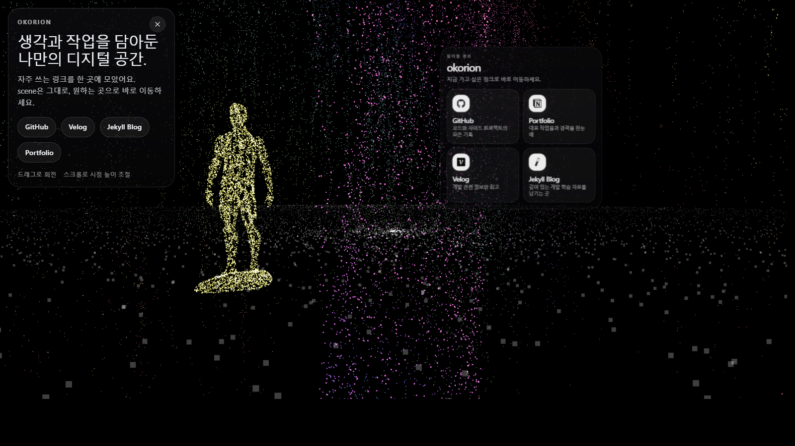

## 최근 UI 업데이트

|메인 장면|브랜드 패널 확장 상태|
|-|-|
|||

- 좌측 상단 브랜드 패널을 최소화/확장 가능한 glass UI로 정리했습니다.
- 우측 3D overlay menu를 카드형 패널로 재구성하고, 링크 정보 계층과 배치를 다듬었습니다.
- 전체 카피를 한국어 중심으로 정리해 장면을 유지한 채 원하는 링크로 바로 이동할 수 있도록 구성했습니다.

### 🖼 시각 효과
#### 수렴 애니메이션 효과
|1|2|3|4|
|-|-|-|-|
|||||

#### 시야 별 입자 효과
|카메라 위치 y >= 0|카메라 위치 y < 0|
|-|-|
|||

|첫 화면|
|-|
||

|가이드 포인트|마우스 인터렉션|
|-|-|
|||

- 그 외
  - 버드나무 내부 Falling Particle 효과
  - 버드나무 Points 색상 그라데이션, 입자 운동
  - 바닥 Floor Points 오브젝트 중앙 입자 밀도 조절, 중심 기준 회전
  - 마우스 인터렉션 보간 적용(Camera Control)

#### 제작 과정
|1|2|
|-|-|
|||

|3|4|
|-|-|
|||

## Docs
- [Codex performance testing docs](./docs/README.md)
